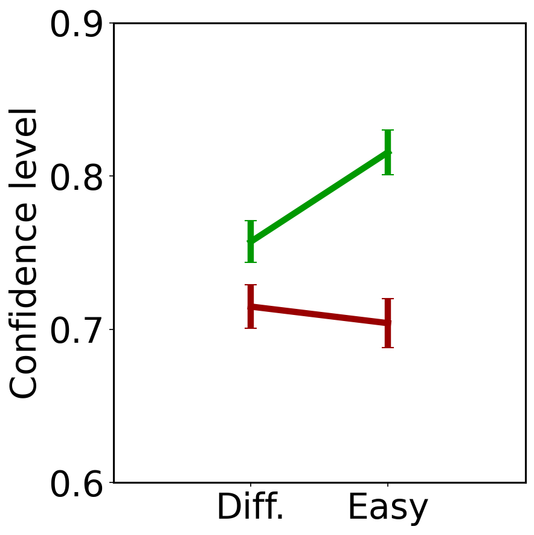
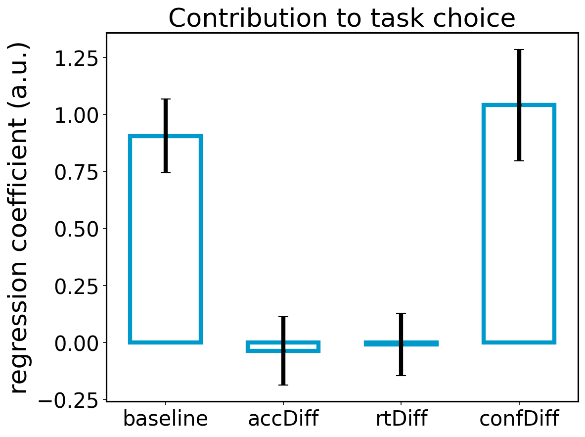
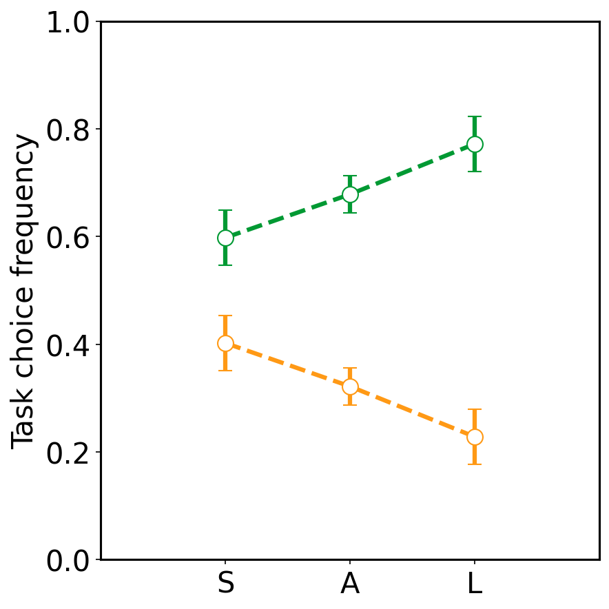
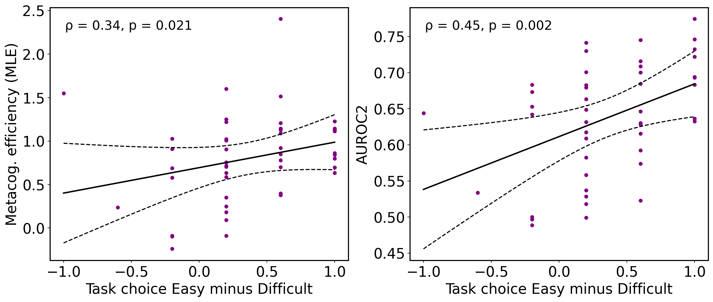

# Replicating methods of deriving metacognitive sensitivity : global self-performance estimates and local confidence 
*Nina Edgley · May 2026*

*Rouault M., Dayan P. & Fleming S. M. Forming global estimates of self-performance from local confidence. Nature Communications (2019)*
---

Self-representation refers to the gradual development of an agent's model of itself, with metacognition being a key process in its sophistication, and potential changes. It grants the ability to change, to learn, and to reflect : to adapt to one's circumstances, or adapt them to one's goals. I've been studying self-representation through the lens of active inference, and exploring how our models come to be. More specifically, I'm curious to understand the degree of flexibility afforded us - to what extent are we shaped by our models, or shape them reflexively? Statistical learning, active inference, and metacognition have all been key frameworks through which to approach this question.
I decided to replicate Rouault, Dayan, & Fleming's *Forming global estimates of self-performance from local confidence. (2019)*, which explores higher-order behavioural control through metacognitive sensitivity - an SDT-derived metric indicating how well subjects' confidence ratings discriminate and correspond to their objective performance. The paper discusses the relationship between feedback, uncertainty, and metacognition in decision-making, and ultimately, how confidence aggregates into global beliefs about our abilities.

---

## Rriginal experiment

Rouault, Dayan, & Fleming developed a perceptual decision-making paradigm to investigate how external feedback and local decision confidence relate to global self-performance estimates, and how these factors are changed in the absence of feedback. Over the course of 3 different experiments, participants were asked to complete 6 short learning blocks that interleaved 2 tasks. Potential tasks varied on 2 dimensions: difficulty (Easy, Difficult), and feedback (Feedback, No Feedback), resulting in 6 task pairings. At the end of each learning block, participants rated (1) which task should be used to calculate a monetary bonus based on their performance at the chosen task, and (2) their overall ability at each task on a continuous scale. 

Both measures operationalised global SPEs, and - when evaluated across the 6 potential task pairings (Difficult+Feedback, Easy+Feedback, Difficult+NoFeedback, etc.) - gave a broader view of how SPE interacted with difficulty and feedback. A candidate hierarchical learning model was tested, containing a perceptual module generating a choice and confidence on each trial, and a learning module updating global SPEs across trials from local decision confidence and feedback, used to make task choices at the end of blocks.

Experiment 1 focused on testing the exact paradigm described above.
Experiment 2 incorporated variations in learning block duration.
Experiment 3 extended the former by adding confidence ratings of participants' perceptual judgements on no-feedback trials. This was done to obtain direct evidence that changes in local confidence were predictive of end-of-block SPEs. It then used these data to evaluate metacognitive sensitivity.

For the purposes of this replication, I focused on Experiment 3, replicating key figures, metacognitive sensitivity fits, and statistical analyses, described below.

---

## Replication

I took the [publicly available data from the Rouault repository](https://github.com/marionrouault/RouaultDayanFleming) and reimplemented the core analyses in Python (paired t-tests, ANOVA, logistic regression model). The original code was in MATLAB.

The main technical challenge was the meta-d' computation, rather than the statistical analyses - the repository contained `scripts/`, which held MATLAB code for replication. I translated these into standard Python, prioritising the key figures for Experiment 3.
The original paper used the MATLAB fit_meta_d_MLE toolbox (Maniscalco & Lau, 2012), whilst the hierarchical Bayesian extension ([Fleming, 2017](https://github.com/metacoglab/HMeta-d)) required JAGS or R. I translated the MLE fitting procedure into Python using `scipy.optimize`, implemented the SDT model and the constrained optimisation over meta-d' and the type-2 criteria. I used Claude Code to help me debug the coordinate-shifted parameterisation, which took several attempts to get right. The nuts and bolts are correct - I tested outputs against the pre-computed ratios contained in the original repository (`mratios`), and got a near 1-1 correspondence.
The other challenge was data wrangling: the original data lived in nested MATLAB structures, which I had to extract from `Exp3.mat` using `scipy.io.loadmat`. The library clearly had its use! This was my first time working with MATLAB, so I ran into a few walls in the beginning around response count arrays, formats, and indexing. Once the syntax was figured out, the process was straightforward.

As mentioned above, I validated the implementation by comparing the Python MLE m-ratio estimates against the pre-computed values in the original data file. They match to the ~third decimal place (Easy: 0.858 vs 0.858; Difficult: 0.738 vs 0.740).

---

## Results

The primary analyses and figures run for Experiment 3 focused on assessing the interaction between feedback, confidence, difficulty, and objective performance. 

### Confidence predicts task choice
This relationship was tested using 2 paired within-subjects t-tests. Confidence was significantly higher for easy than difficult trials (p < 0.001), confirming the manipulation works.

*Figure 1: Confidence tracks task difficulty — higher for easy trials (green) than difficult trials (red), confirming the difficulty manipulation worked.*

The original analysis proposed a logistic regression to further assess the contribution that different factors exerted on task choice in the absence of feedback. Two models were run (full and reduced) to control for the different regressors. Both models focused on the trial data unique to Experiment 3 : task choices in no-feedback ratings (with explicit confidence ratings). BIC values were computed for both, and used as the basis for a standard model comparison.
- Full model : 3 regressors - xAcc, xRT, xConf
- Reduced model : 2 regressors - xAcc, xRT

A model comparison (ΔBIC = 22.3922) confirmed that confidence significantly improves prediction of task choice, beyond accuracy and reaction time alone. This replicates Rouault, Dayan, & Fleming's initial result, that local confidence was a key input, aggregating to form global SPE (task choice being its proxy). 

*Figure 2: Logistic regression coefficients predicting task choice. Confidence difference (confDiff) is a significant predictor above and beyond accuracy difference (accDiff) and reaction time difference (rtDiff).*

Finally, no-feedback conditions were also analysed through the lens of task choice frequencies, relatively to difficulty and confidence. As shown below, mean trial-by-trial confidence values for the 2 tasks were subtracted from one another, then sorted into 3 buckets : small, average, and large differences in confidence between the tasks. As Figure 3 shows, participants increasingly chose the task where they had higher confidence, in step with the relative difference in confidence levels across both tasks.

*Figure 3: Participants increasingly chose the task where they had higher confidence.*

### Metacognitive efficiency predicts global self-evaluation

Metacognitive efficiency, measured here as M-ratio (meta-d' / d'), captures how well someone's confidence ratings distinguish their own correct from incorrect responses, independent of actual task performance. An M-ratio of 1 means confidence is informationally optimal, sub-1 that information is lost between deciding and rating confidence. The key results for the paper was that metacognitive efficiency correlated with global SPEs for both MLE and AUROC-2 (non-parametric alternative), with AUROC-2 showing a stronger correlation.
- MLE : ρ = 0.34, p = 0.021
- AUROC-2 : ρ = 0.45, p = 0.002

*Figure 4: Left — Metacognitive efficiency (M-ratio, MLE) correlates with global self-performance estimates (ρ = 0.34, p = 0.021). AUROC2 shows a stronger version of the same relationship (ρ = 0.45, p = 0.002).*

---

## Code

All analyses are in Jupyter notebooks: [github.com/ninaedgley/rouault-exp3-replication](https://github.com/ninaedgley/rouault-exp3-replication).
`01_load_data.ipynb` : preprocessing, MATLAB file extraction
`02_replication.ipynb` : statistical analyses and figure replications
`03_metad.ipynb` : meta-d' translation to Python, MLE and validation

Figures can be found under `outputs/`.

---

## Takeaways

Overall, I was surprised at how my time was spent within this replication. I had expected for the Python translation to be most time-intensive, only to realise that it was actually the process of understanding the repository's data structures (particularly as they lived in MATLAB - this being my first time using the language). I spent several hours figuring out which variables mapped to which analysis, idem for the files, and trying to understand the contents of various structures from their shapes.

The paper was clear, and I really enjoyed using meta-d' and hmeta-d' : I didn't end up replicating the hierarchical model, but I read through the [HMeta-d toolbox](https://github.com/metacoglab/HMeta-d), and [related paper](https://academic.oup.com/nc/article/2017/1/nix007/3748261?login=false). I'd previously worked on simple SDT models, so combining the hierarchical Bayesian extension with the Python translation (which required understanding the nuts and bolts much more than I previously did + understanding type-2 criterion and how to incorporate them confidence-graded paradigms) was a great project to learn more. The coordinate-shifted parameterisation in particular was valuable, because it forced me to revisit optimisation relative to free parameters - it took a second to understand why the first attempts were unstable. Eventually ceded to Claude on the code, but really enjoyed working through it conceptually.

---

## Next Steps!

It would be interesting to extend this into a full implementation of the hierarchical Bayesian HMeta-d' in PyMC (from a technical perspective). Translating it into Python could make the method more accessible. Alternatively - and from a conceptual perspective - I'd love to explore more paradigms on metacognition, unrelated to task performance. Testing, for example, whether people demonstrate varying sensitivity in self-representational properties, rather than objective performance on a task, in a way that can be operationalised or quantified directly.

---

*Reference: Rouault, M., Dayan, P., & Fleming, S. M. (2019). Forming global estimates of self-performance from local confidence. Nature Communications, 10(1), 1141.*
